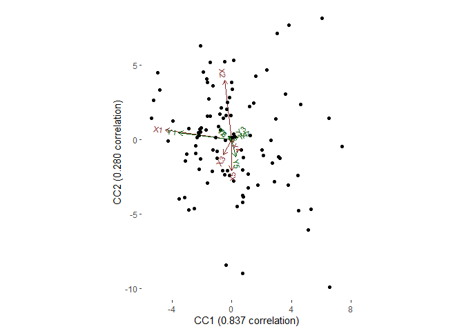

acca package
================
livio

<!-- README.md is generated from README.Rmd. Please edit that file -->

# acca: **a** **c**anonical **c**orrelation **a**nalysis

-----

## SetUp

To **install** this package (in R):

    #if devtools is not installed yet: 
    # install.packages("devtools") 
    library(devtools)
    install_github("livioivil/acca")

-----

``` r
L=matrix(rnorm(100),100,1)
X=matrix(rnorm(500),100,5)
Y=matrix(rnorm(700),100,7)
Z=matrix(rnorm(200),100,2)
X[,1]=X[,1]+2*L
Y[,1]=Y[,1]+2*L


library(acca)
mod=cc(X,Y,Z)
mod
```

    ## a Canonical Correlation Analysis
    ##               n obs:  100
    ##       n X variables:  5
    ##       n Y variables:  7
    ##        Correlations:  0.837 0.280 0.222 0.202 0.079

``` r
ggbiplot2(mod)
```

    ## Loading required package: ggplot2

<!-- -->

Testing null correlation of the canonical compoments

``` r
mod=cc_inference(mod,B = 1000,numb_cc = 3)
summary(mod)
```

    ## a Canonical Correlation Analysis
    ##               n obs:  100
    ##       n X variables:  5
    ##       n Y variables:  7
    ##        Correlations:  0.837 0.280 0.222 0.202 0.079
    ##            p-values:  0.001 0.996 1.000 1.000 1.000
    ##         n perms (B):  1000
